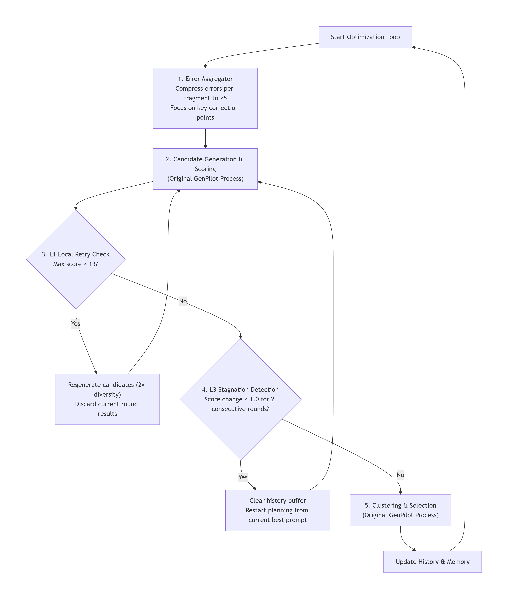

# CriticPilot: GenPilot with Planner-Critic Mechanism

**Course**: Computer Graphics A (Spring 2026 · Fudan University) — Project 3

---

## Abstract

Test-time prompt optimization in text-to-image generation aims to improve prompts through iterative refinement to make generated images more accurately match user intent. However, existing methods like GenPilot adopt a linear feed-forward pipeline lacking internal verification mechanisms, facing two core bottlenecks: error overload and history pollution. Inspired by PixelCraft's Planner-Critic architecture, this paper proposes CriticPilot, a lightweight extension to GenPilot. CriticPilot embeds three core modules into the original optimization process: an error aggregator, L1 local retry, and L3 global reset, endowing the system with self-correction capabilities. Experiments on 10 batches of complex prompts demonstrate that CriticPilot achieves an average score improvement of 0.4118 points (13.3485 → 13.7604), while reducing average evaluation rounds by 1.5, validating the effectiveness and efficiency of the proposed mechanisms.

**Open Source Code**: https://github.com/zdleeeeee/PlannerCritic-GenPilot

---

## 1. Introduction

The field of text-to-image (T2I) generation has made significant progress in recent years, but enabling generated images to accurately match complex textual descriptions remains an open challenge. Test-Time Prompt Optimization, as a lightweight solution that requires no model fine-tuning, has garnered widespread attention by iteratively improving prompts to enhance generation quality.

GenPilot (Yuan et al., 2025) is a representative work in this field, leveraging multimodal large language models to conduct fine-grained error analysis on generated images and generate correction suggestions accordingly, achieving excellent results on multiple benchmarks. However, GenPilot employs a **linear feed-forward pipeline** lacking internal verification mechanisms. As the authors acknowledge, VQA-based error detection is unreliable in complex scenarios. Once early-round error analysis deviates, subsequent optimization builds upon erroneous premises, leading to problem accumulation without the ability to self-correct.

Specifically, GenPilot faces two core bottlenecks:

- **Error Overload**: Fine-grained error analysis may generate numerous redundant error descriptions (measured at over 500 for a single prompt segment), causing optimization objectives to diverge and key correction directions to be obscured.
- **History Pollution**: The linear cumulative optimization paradigm continuously propagates error modification records generated during early iterations to subsequent rounds. Once early deviations from the correct direction occur, errors accumulate continuously, ultimately causing scores to stagnate at local optima.

Inspired by **PixelCraft's Planner-Critic architecture** (Microsoft, 2025)—which introduces a critic agent to review reasoning trajectories and triggers backtracking when errors are detected—this paper proposes **CriticPilot**, an extension to GenPilot. CriticPilot embeds the Planner-Critic mechanism into the original optimization process, endowing the system with self-correction capabilities through error aggregation and hierarchical backtracking, achieving an efficient closed loop for test-time prompt optimization. Experiments demonstrate that CriticPilot achieves an average score improvement of 0.4118 points across 10 batches of complex prompts while reducing average evaluation rounds by 1.5.

The main contributions of this paper are as follows:
1. Identified the two bottlenecks of error overload and history pollution in GenPilot's linear optimization process;
2. Proposed CriticPilot, a lightweight self-correction framework incorporating an error aggregator, L1 local retry, and L3 global reset;
3. Validated the effectiveness and efficiency of the proposed mechanisms across multiple complex prompt batches.

---

## 2. Related Work

### 2.1 GenPilot: Test-Time Prompt Optimization

GenPilot (Yuan et al., 2025) is a multi-agent test-time prompt optimization system that iteratively improves prompts through two stages: the **error analysis stage** utilizes VQA and Captioning agents to identify semantic inconsistencies between generated images and prompts; the **prompt optimization stage** generates multiple candidate corrections, selects the optimal one through scoring and clustering, and proceeds to the next iteration.

**Limitations**: GenPilot's process is strictly linear with no process-level verification mechanisms. As stated in the paper, "VQA-based error detection is unreliable in complex scenarios." If deviations occur during the error analysis stage, subsequent optimization builds upon erroneous premises, and the system cannot detect or recover from them.

### 2.2 PixelCraft: Planner-Critic Architecture

PixelCraft (Microsoft, 2025) is a multi-agent visual reasoning system whose core innovation lies in its **Planner-Critic architecture**: a critic agent (Critic) is responsible for reviewing the planner's (Planner) reasoning trajectory, detecting inefficiencies or errors in tool usage sequences, and triggering backtracking and branch exploration when problems are discovered. Specific mechanisms include: (1) **Posterior refinement**: the critic reviews the entire reasoning trajectory after discussion completion; (2) **Backtracking and branching**: through image memory storing intermediate results, the planner can backtrack to previous steps when encountering contradictions and explore other reasoning paths.

This paper draws upon PixelCraft's core ideas, adapting them to the prompt optimization domain—replacing explicit Critic LLMs with error aggregation and score stagnation detection to achieve similar self-correction capabilities in a lightweight manner.

---

## 3. Method

CriticPilot inserts three core modules into GenPilot's standard optimization loop, with the overall architecture shown in Figure 1.

Figure 1: CriticPilot Architecture Overview



### 3.1 Error Aggregator

**Problem**: Fine-grained error analysis may generate numerous redundant errors (measured at over 500 for a single segment), causing optimization objectives to diverge.

**Method**: Before each round of optimization, perform semantic clustering on all error feedback related to the current prompt, deduplicate by dimensions such as entity and attributes, and constrain the number of errors associated with each prompt segment to no more than 5.

**Effect**: Compresses redundant errors by an order of magnitude, focusing on key correction points and fundamentally avoiding optimization signal overload.

### 3.2 L1 Local Retry

**Problem**: Candidate prompts generated in a single round may have overall low quality (e.g., due to sampling randomness).

**Detection Condition**: The highest score among all candidate prompts in the current round is less than 13 (out of 15 points).

**Action**: Discard the current round's results and regenerate candidates with higher diversity in the same optimization context (candidate count doubled).

**Design Rationale**: Drawing from PixelCraft's "branching" concept, conducting branch exploration at the micro-level to rescue low-quality rounds caused by sampling randomness at low cost.

### 3.3 L3 Global Reset

**Problem**: Historical modification records (history buffer) may be contaminated by erroneous information, causing optimization to become trapped in local optima.

**Detection Condition**: For 2 consecutive rounds, the maximum score improvement is less than 1.0 points.

**Action**: Clear all accumulated historical error modification records, forcing the next round to restart planning from the current optimal prompt.

**Design Rationale**: Drawing from PixelCraft's "backtracking" concept, breaking the constraints of erroneous history on the search direction, giving the system the opportunity to escape local optima.

---

## 4. Experiments

### 4.1 Experimental Setup

**Models and Computing Platform**:
- Error analysis: Qwen3-VL-8B-Instruct
- Text-to-image generation: FLUX.1 (black-forest-labs/FLUX.1-schnell)
- All code built upon the GenPilot framework

**Test Data**: 10 test batches, each containing several carefully constructed complex prompts covering typical failure patterns such as object counting, spatial relationships, and attribute binding.

**Baseline**: Standard GenPilot optimization process without any CriticPilot modules.

**Evaluation Metrics**:
- Generation quality: automatically assessed by a unified multimodal scoring model, maximum 15 points
- Computational overhead: actual rounds of image generation and scoring calls (Scored Rounds)
- Mechanism activity: trigger counts for L1 local retry and L3 global reset

### 4.2 Overall Scoring Performance

Aggregated data from 10 batches shows that CriticPilot achieves an average score of 13.7604, compared to the baseline of 13.3485, an improvement of **+0.4118 points**. Except for Batch6, which remains essentially flat (Δ = -0.033), all other 9 batches record positive gains, with Batch4 showing the most significant improvement with Δ reaching +0.841, demonstrating the mechanism's good generalizability.

Table 1: Overall Scoring Performance (10 Batches)

| Batch   | Baseline avg | Critic avg | Delta  | L1   | L3   | Baseline scored rounds | Critic  scored rounds | Scored rounds  difference |
| ------- | ------------ | ---------- | ------ | ---- | ---- | ---------------------- | --------------------- | ------------------------- |
| 1       | 13.5         | 13.605     | 0.105  | 13   | 4    | 28                     | 38                    | 10                        |
| 2       | 13.87        | 14.316     | 0.446  | 3    | 1    | 23                     | 19                    | -4                        |
| 3       | 13.371       | 13.871     | 0.5    | 8    | 1    | 35                     | 31                    | -4                        |
| 4       | 12.288       | 13.13      | 0.841  | 38   | 1    | 59                     | 54                    | -5                        |
| 5       | 12.69        | 13.39      | 0.7    | 20   | 4    | 42                     | 41                    | -1                        |
| 6       | 13.85        | 13.817     | -0.033 | 9    | 5    | 60                     | 60                    | 0                         |
| 7       | 13.211       | 13.628     | 0.417  | 17   | 3    | 38                     | 43                    | 5                         |
| 8       | 13.588       | 14.045     | 0.457  | 11   | 3    | 51                     | 44                    | -7                        |
| 9       | 13.242       | 13.469     | 0.227  | 22   | 5    | 62                     | 64                    | 2                         |
| 10      | 13.875       | 14.333     | 0.458  | 1    | 1    | 32                     | 21                    | -11                       |
| Overall | 13.3485      | 13.7604    | 0.4118 | 14.2 | 2.8  | 43                     | 41.5                  | -1.5                      |

Figure 2: Baseline vs CriticPilot Image Quality Average Score Comparison


Figure 3: CriticPilot Relative to Baseline Image Quality Average Score Difference


### 4.3 Computational Overhead and Efficiency

Typically, retry and reset mechanisms introduce additional computational overhead. However, experimental data shows that CriticPilot's average evaluation rounds are 41.5, lower than the baseline's 43, an average reduction of **1.5 rounds**. The reason is that L1 and L3 serve a dual role of "pruning" and "navigation": local retry prevents invalid low-score rounds from being counted and wasting subsequent optimization; global reset decisively terminates stagnant paths, redirecting computational resources to a broader search space.

Figure 4: Baseline vs CriticPilot Average Evaluation Rounds


Figure 5: CriticPilot Relative to Baseline Average Evaluation Rounds Difference


### 4.4 Mechanism Trigger Frequency

Statistics on average trigger counts per batch show: L1 triggers 14.2 times, L3 triggers 2.8 times. The high frequency of L1 triggers indicates that low-quality candidates are frequently generated during the original optimization process, and local retry provides an inexpensive self-rescue mechanism. The lower but significant frequency of L3 triggers—each global reset enables the system to break free from erroneous history and gain opportunities to re-explore and find better solutions (such as the significant score jump after L3 triggering in Batch4). This frequency confirms that stagnation is not an occasional phenomenon but an inherent drawback of linear optimization.

Figure 6: L1 and L3 Trigger Counts


### 4.5 Case Analysis

#### Success Case A: Precise Counting Constraint (Batch1)

**Original Prompt (excerpt)**: "A cabbage field with exactly 8 cabbages, each cabbage has dewdrops, and the field is covered with light mist."

**Baseline Problem**: The number of cabbages generated frequently deviates from 8, and dewdrops and mist are often lost, with scores oscillating around 12.

**Mechanism Effect**: The error aggregator focuses errors on "counting" and "visibility". Through repeated L1/L3 intervention, the system evolves extremely strong hard constraints, for example: "… featuring exactly eight distinct cabbages, no more and no fewer. Every cabbage must display visible dew droplets. A light veil of mist hangs over the entire field …". The highest score jumped from 13 to 15 (perfect score), successfully breaking the optimization ceiling.

#### Success Case B: Eliminating Object Hallucination (Batch4)

**Original Prompt**: "A silver bracelet resting on a chessboard, the bracelet is compact, not larger than one square."

**Baseline Problem**: Produced severe hallucinations, incorrectly generating "stethoscopes" with tubular structures instead of "silver bracelets", and the size was enormous, spanning multiple chessboard squares.

**Mechanism Effect**: Error aggregation locked onto two core issues: "incorrect object type" and "uncontrolled size". The system generated highly targeted negative prompts (explicitly excluding stethoscope components, such as "no chestpiece, no tubes") and utilized spatial constraints with scene reference objects ("the bracelet must be no larger than one chessboard square"). Hallucinations were stably eliminated, significantly raising the lower bound of generation quality and greatly reducing low-score rounds, thus Batch4's Δ reached as high as +0.841.

#### Outlier Analysis: Batch6

Among all 10 batches, Batch6 is the only one with a negative Δ (-0.033). Both achieved perfect scores of 15, and evaluation rounds were identical (60 rounds), with differences only stemming from minor fluctuations in candidate quality.

**Case Details**: The prompt required "A vintage fan with a rounded base placed beside an antique knife on a wooden table". The baseline performance was already strong, but Critic, to strengthen the distinction between the fan and knife, adopted overly aggressive exclusive descriptions (such as "loose circular fan head / no pedestal base"), which deviated from the original prompt's inherent requirement for "rounded base", causing slight score decreases in some rounds.

**Root Cause and Insights**: When the baseline already approaches performance limits, or when the original prompt itself has semantic ambiguity, Critic's strong constraints may lead to over-correction. This boundary condition reveals that future work could introduce adaptive intervention strategies, appropriately reducing the aggressiveness of retry and reset in later optimization stages to avoid introducing new contradictions due to overfitting to error signals. Overall, Batch6 should be regarded as "Critic essentially on par with Baseline" rather than a significant failure.

---

## 5. Conclusion

This paper proposes CriticPilot, a lightweight extension to GenPilot that addresses the problems of error overload and history pollution in the linear optimization process by embedding a Planner-Critic mechanism. Experiments validate the core value of CriticPilot:

1. **Efficiency Without Cost**: Under the premise of reducing average evaluation rounds by 1.5, the average score improved by 0.4118 points, proving that "quality control and error backtracking" is more important than "simply stacking iteration rounds".

2. **Dual Improvement of Upper and Lower Bounds**: L1 local retry suppresses low-score rounds, stabilizing the performance floor; L3 global reset clears historical contamination, elevating the score ceiling.

3. **High Robustness**: Achieved positive gains in 90% of test batches, with only one ambiguous scenario showing an acceptable minor regression, and no crashes occurred.

In summary, CriticPilot, as a lightweight solution with minimal architectural changes and no additional LLM calls, addresses the problems of computational waste and stagnation in automated prompt optimization with a high cost-effectiveness ratio. Future work will explore adaptive intervention strategies to appropriately reduce the aggressiveness of retry and reset in later optimization stages to avoid introducing new contradictions due to over-correction.

---

## References

1. @misc{ye2025genpilotmultiagenttesttimeprompt,
         title={GenPilot: A Multi-Agent System for Test-Time Prompt Optimization in Image Generation}, 
         author={Wen Ye and Zhaocheng Liu and Yuwei Gui and Tingyu Yuan and Yunyue Su and Bowen Fang and Chaoyang Zhao and Qiang Liu and Liang Wang},
         year={2025},
         eprint={2510.07217},
         archivePrefix={arXiv},
         primaryClass={cs.CV},
         url={https://arxiv.org/abs/2510.07217}, 
   }

2. @misc{zhang2025pixelcraftmultiagenthighfidelityvisual,
         title={PixelCraft: A Multi-Agent System for High-Fidelity Visual Reasoning on Structured Images}, 
         author={Shuoshuo Zhang and Zijian Li and Yizhen Zhang and Jingjing Fu and Lei Song and Jiang Bian and Jun Zhang and Yujiu Yang and Rui Wang},
         year={2025},
         eprint={2509.25185},
         archivePrefix={arXiv},
         primaryClass={cs.CV},
         url={https://arxiv.org/abs/2509.25185}, 
   }

3. GenPilot Open Source Code. https://github.com/27yw/GenPilot

---

## Appendix A: Division of Labor

- **Li Zedong(李泽栋) 23307130271**: Designed experimental idea and plan, reproduced baseline, built basic project code framework, wrote experimental report and made ppt
- **Yan Haopeng(颜皓鹏) 24300240240**: Implemented CriticPilot code, executed testing, recorded data
- **Shen Zixuan(沈子轩) 24300240213**: Analyzed data, organized results

---

## Appendix B: System Implementation and Reproduction Guide

### Project Structure

```
PlannerCritic-GenPilot
├── .env.example
├── .gitignore
├── .python-version
├── LICENSE
├── README.md
├── data/
│   ├── original_prompts.txt
│   └── original_prompts_299.txt
├── genpilot/
├── pyproject.toml
├── run_baseline.py
├── tests/
│   ├── test_compare_metrics.py
│   ├── test_error_taxonomy.py
│   └── test_scorer_json.py
└── uv.lock
```

### Installation and Environment Configuration

```bash
# Clone repository
git clone https://github.com/zdleeeeee/PlannerCritic-GenPilot.git
cd PlannerCritic-GenPilot

# Copy environment configuration files
cp .env.example .env
cp genpilot/error_analysis_pipline.sh.example genpilot/error_analysis_pipline.sh

# Install dependencies (using uv)
uv sync

# Download text-to-image model (if needed)
hf download black-forest-labs/FLUX.1-schnell --local-dir <local download path>
```

> **Note**: We upgraded the `mkl-service` package from 2.4.0 to 2.5.2 in the genpilot environment to resolve its incompatibility with Python 3.12.

### Running Process

```bash
python run_baseline.py
```

This script runs both the baseline GenPilot and CriticPilot simultaneously.

### Testing

```bash
tests/test_error_taxonomy.py
tests/test_scorer_json.py
tests/test_compare_metrics.py
```